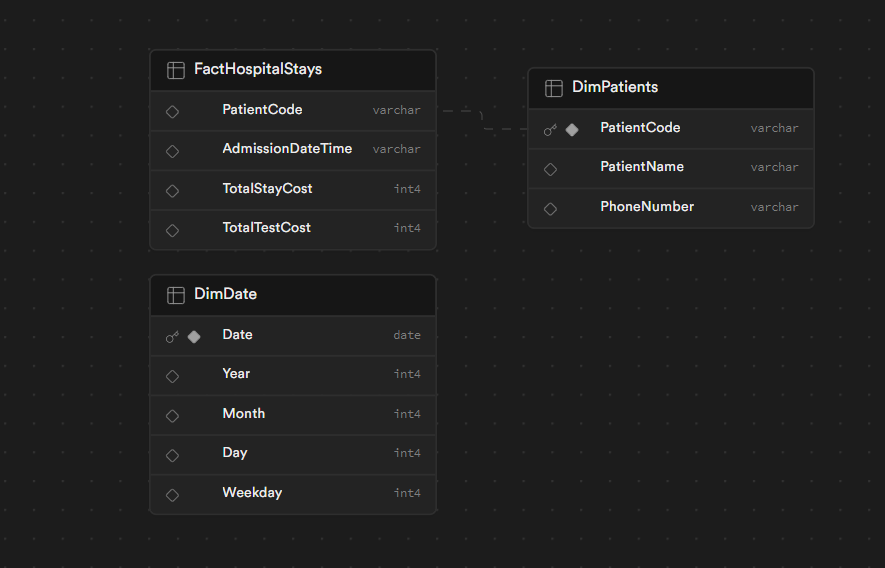

# Hospital Data ETL Process

This project implements an ETL process for hospital data, storing transformed data into a data warehouse structured with dimension and fact tables.

### Prerequisites

- Python 3.10.2+
- PostgreSQL database
- Apache Airflow (for automation)

## Setup

1. **Install Requirements**: Run `pip install -r requirements.txt` to install the necessary Python packages.
2. **Database Setup**: Ensure your PostgreSQL database is accessible and the `warehouse` schema is created as described in the provided SQL scripts.
3. **Airflow Setup**: If running the ETL process via Airflow, ensure Airflow is installed and configured on your system. Follow the [official Airflow documentation](https://airflow.apache.org/docs/apache-airflow/stable/start/index.html) for setup instructions.

# Database Accesibility
To access the database,  use the connection string provided via email. Example: `user=postgres.dmqojkyleazensskawns password=[YOUR-PASSWORD] host=aws-0-sa-east-1.pooler.supabase.com port=5432 dbname=postgres`

## Running the ETL Process

- **Manually**: Execute the `database_connection.py` to run the ETL process manually.
- **Via Airflow**: Place the DAG file in your Airflow dags directory and trigger the DAG via the Airflow UI. The default root should be `/opt/airflow/dags`

# ETL Process Overview
> [!NOTE]
> The ETL (Extract, Transform, Load) process is designed to facilitate the movement of data from operational databases to a data warehouse for analytical purposes. This README provides an overview of the ETL process implemented for the provided scenario.

## Process Steps

### Initial stage
For the warehousing script to correctly execute, you will need to run the provided DDL in Appendix A into the Postgres Engine used (In this case i used Supabase)

### 1. Extract

Data is extracted from the source tables in the operational database. These tables contain various types of information, including patient details, admissions, tests, and more. The structure of these tables is defined in the provided Data Definition Language (DDL) documentation.

### 2. Transform

The extracted data undergoes transformation processes to prepare it for analytical use. This involves:

- Calculating total stay costs and test costs for each patient admission.
- Normalizing data formats to ensure consistency and compatibility.
- Preparing the data for loading into the data warehouse schema.

### 3. Load

The transformed data is loaded into the warehouse schema. The data warehouse is organized with dimension tables and a fact table:

- **Dimension Tables:** These tables contain descriptive attributes that provide context for analytical queries. Examples include "DimPatients" and "DimDate".
- **Fact Table:** This table contains key performance indicators and metrics derived from the operational data. In this scenario, the fact table is named "FactHospitalStays" and is designed to support queries related to patient stays, costs, and other relevant metrics.

## ERD
Entity relation diagram for the fact and dimension tables. 

